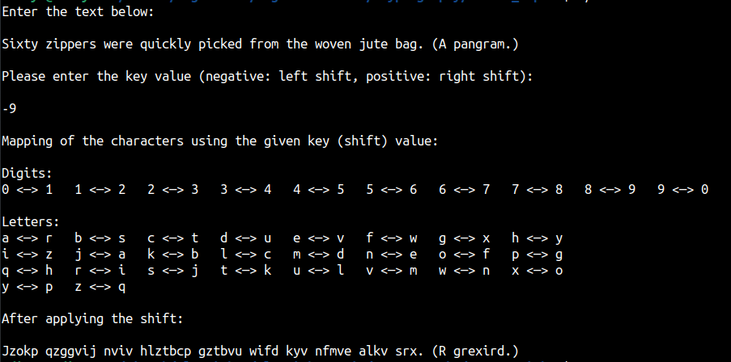

This is a simple program for implementing the Caeser cipher. It correctly works for the positive as well as the negative value of the shift-key. It shifts each letter in the user input with
value provided by the user. It can work for lowercase and uppercase letters. Digits are shifted from 0 to 9. A digit is replaced only by a digit, and a letter with a shifted letter.

Any other characters are left unchanged.

Example:

