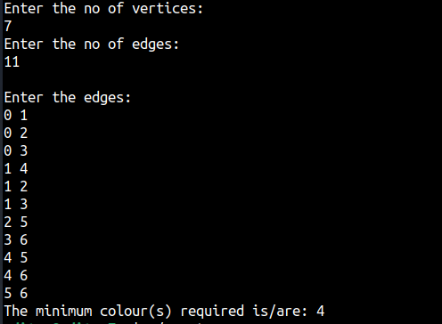

Graph colouring algorithm is use to solve the problem of colouring/labeling two adjacent vertices such that they do not have the same colour. It finds the solution to doing so with minimum number
of different colours. This implementation uses the greedy technique.

Output:

