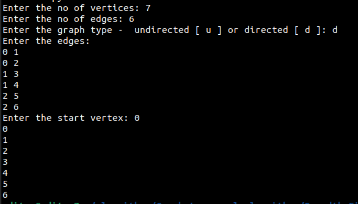

User will prompted to enter the number of vertices. The number of vertices will decide the valid vertices for the graph.

For example, if you enter the vertices as 4 then an adjacency list of 0-4 indexed will be created with the size of the list = 5.

Then the user is asked to enter the number of edges.

The user also decides whether the graph will be directed or undirected graph.

In an undirected graph, there will be an edge from vertex 1 to vertex 2, and from vertex 2 to vertex 1. But in a directed graph there will only be a single edge.

Then the user will asked to enter the edge or edges. If the vertex is greater than the value of number of vertices, then it will asked to re-enter that vertex in the range
0-number of vertices as entered by the user at the beginning of the program.

Sample output of the program (C++):

Sample output of the program (Python):

