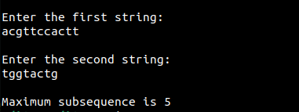

Longest common subsequene is use to find the maximum number of match characters in a string.

Time complexity: O(mn) where m is the length of the longer string, and n is the length of smaller string.

Sample output of the program:

