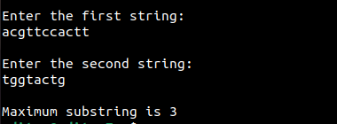

The longest common substring finds the longest common string of characters in the given strings. 

Time complexity: O(mn) where m is the length of the longer string, and n is the lenght of the smaller one.

Sample output of the program:

