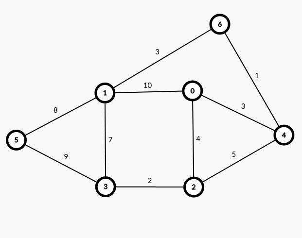
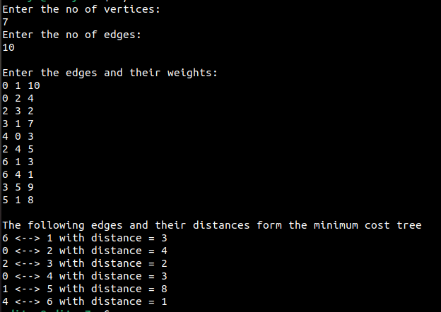
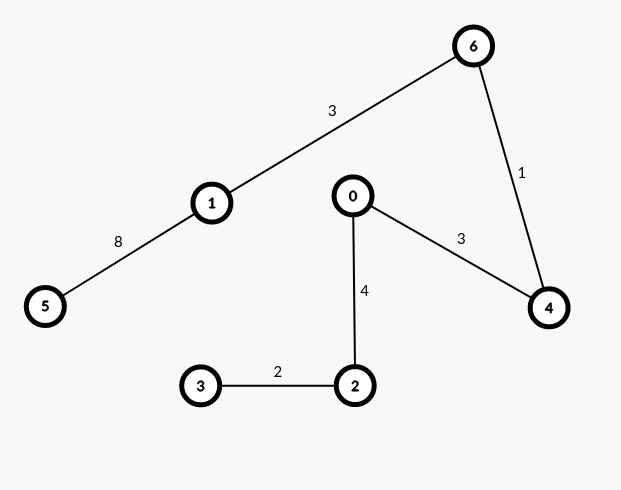

Prim's algorithm works on connected undirected graph. It finds the minimum spanning tree for the given graph.

When the below graph is given as an input to the program:

 

(Via: https://csacademy.com/app/graph_editor)

It produces the given output:

If you take the output of the program, and plug the values in the graph editor, this is the result:

