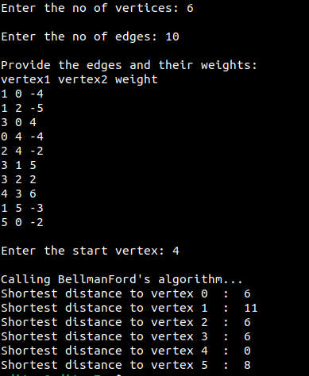

Bellmand-Ford algorithm can work with negative edges in a directed graph. 

Consider the graph below:

Created via: https://csacademy.com/app/graph_editor

Sample output of the Python implementation:

