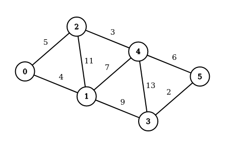
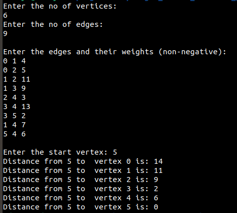
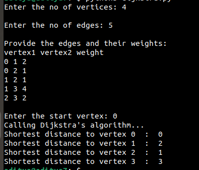

Dijkstra's algorithm is a greedy algorithm for finding the shortest paths from a given single source.

It finds the minimum cost path from a single source vertex to all the vertices in a graph.

Consider the graph below:

NOTE: Graph created using the website: https://csacademy.com/app/graph_editor.

User will asked for the number of vertices and the number of edges.

Then the edges with their weight in the format: 

vertex1 vertex2 weight

The same graph above given as input in the textual form, after applying the algorithm it finds the minimum distance to all the vertices from the start vertex 5:

Sample output of the python implementation:

